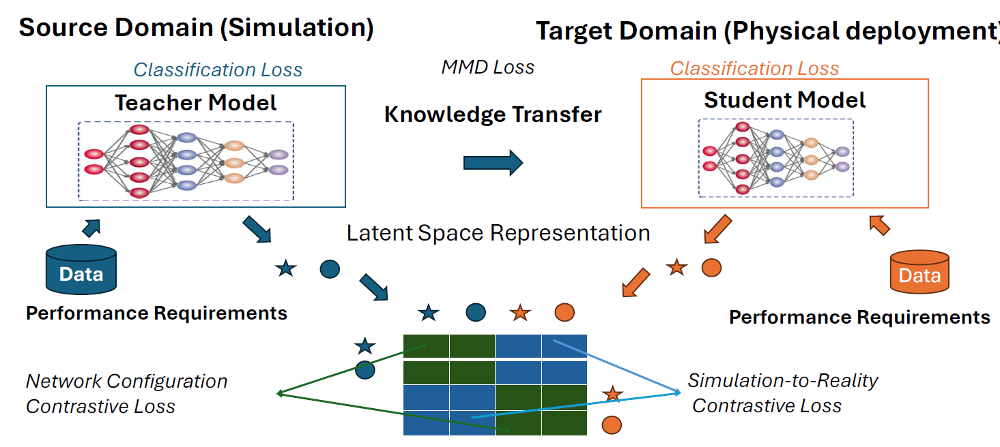
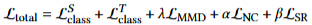
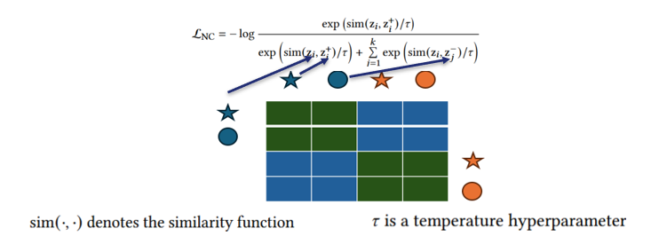
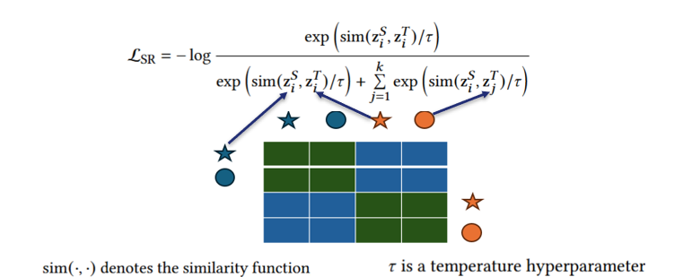
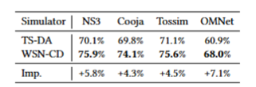
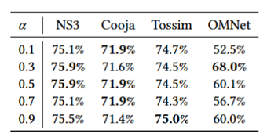
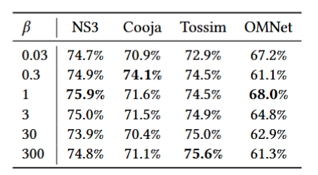
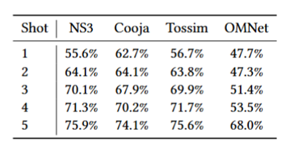

# WMN-CDA: Contrastive Domain Adaptation for Wireless Mesh Network Configuration (ACM SAC 2025)

📄 [**Paper Link**](https://users.cs.fiu.edu/~msha/publications/sac25.pdf)

This repository contains the official implementation of **WMN-CDA**, a contrastive domain adaptation framework for wireless mesh networks. WMN-CDA is designed to improve network configuration prediction by effectively

## 📌 Overview

**WMN-CDA** aims to bridge the performance gap between simulation and real-world network environments by aligning network configuration representations through a contrastive learning framework. Our model learns both domain-invariant and domain-specific features using simulation data as the source domain and physical measurements as the target domain.



In the architecture diagram, blue stars and circles represent network requirement representations in the **source domain (simulation)**, while orange ones denote the **target domain (reality)**. WMN-CDA aligns similar configurations and contrasts dissimilar ones, enhancing generalization across domains at the network configuration level.

---

## 🛠️ Installation

You can install the dependencies using the following command:

```bash
pip install -r requirements.txt
```


## 📂 Data

### 📚 Training Data

The training data consists of the following components:

- **Physical Data**  
  Directory: `data/training/physicalData`

- **Simulation Data**  
  Directory: `data/training/simulationData`

- **Physical Data with Sampling Algorithm** *(Generated by Code)*  
  Directory: `data/training/PhysicalDataWithSamplingAlgorithm/`

---

### 🧪 Testing Data

- Directory: `data/testing/testData.csv`

---

### 📝 Data Format

The data includes the following components:

#### **Header Columns**

- `A`: Represents a network configuration parameter.  
- `C`: Number of channels used in the network.  
- `P`: PRR (Packet Reception Ratio) threshold for link selection.  
- `B`: Represents another network configuration parameter.  
- `L`: End-to-end latency (network performance metric).  
- `R`: End-to-end reliability (network performance metric).  
- `LA`: Represents a network configuration parameter.

---

### ⚙️ Network Configurations

- **PRR Threshold (`P`)**: Determines the minimum acceptable Packet Reception Ratio for link selection.  
- **Number of Channels (`C`)**: Specifies the number of communication channels used in the network.  
- **Transmission Attempts per Packet (`A`)**: Indicates the number of retry attempts scheduled for each packet.

---

### 📈 Network Performance Metrics

- **End-to-End Latency (`L`)**: Measures the total time a packet takes to travel from source to destination.  
- **Battery Lifetime (`B`)**: Represents how long the nodes can operate using their current battery supply.  
- **End-to-End Reliability (`R`)**: Indicates the success rate of delivering packets across the network.

> The data format is specifically designed to support the `LA` network configuration setting.


## 🧠 Loss Functions

WMN-CDA optimizes the following losses:

- **Source domain classification loss** (teacher model)
- **Target domain classification loss** (student model)
- **MMD loss**: aligns feature distributions between source and target domains
- **Network Configuration Contrastive Loss**: aligns representations under similar configurations within the same domain
- **Simulation-to-Reality Contrastive Loss**: encourages similar representations across domains under the same configuration



### 🔹 Network Configuration Contrastive Loss

Encourages similarity between positive configuration pairs (e.g., anchor and augmented views) and dissimilarity with negative ones — all within the same domain.



### 🔸 Simulation-to-Reality Contrastive Loss

Aligns corresponding configurations across simulation and reality to reduce domain shift.



---

## 📊 Performance Evaluation

We evaluate WMN-CDA on a physical testbed with **50 wireless devices** and four popular simulators: **NS-3, Cooja, Tossim, and OMNet**.




### ▶️ Run the default experiment:

```bash
python3 cda_exp_rs0.py
```

---

## 🔧 Hyperparameter Sensitivity

### 1. **Effect of Alpha (𝛼)**: Network Configuration Contrastive Loss

We fix 𝛽 = 1 and vary 𝛼 ∈ {0.1, 0.3, 0.5, 0.7, 0.9}.

Results indicate that **𝛼 = 0.3** yields the best performance.



Run the alpha experiments:

```bash
python3 cda_exp_diff_keyparameter_alpha_rs0.py
```

### 2. **Effect of Beta (𝛽)**: Simulation-to-Reality Contrastive Loss

We fix 𝛼 = 0.3 and vary 𝛽 ∈ {0.003, 0.3, 1, 3, 30, 300}.





Run the beta experiments:

```bash
python3 cda_exp_diff_keyparameter_beta_rs0.py
```

## 🔍 Few-Shot Evaluation

We analyze how WMN-CDA performs with varying amounts of physical data (1 to 5 shots). Results demonstrate consistent improvement with increased real data.



Run the few-shot experiments:

```bash
python3 cda_exp_fewshot_rs0.py
```


## 📁 Project Structure

- `cda_exp_rs0.py` – main experiment script
- `cda_exp_diff_keyparameter_alpha_rs0.py` – alpha sensitivity experiments
- `cda_exp_diff_keyparameter_beta_rs0.py` – beta sensitivity experiments
- `cda_exp_fewshot_rs0.py` – few-shot learning experiments
- `models/`, `utils/`, `losses/` – model components and training utilities

---


## 📄 Publications

This work has been published in the **IEEE/ACM Transactions on Networking**, 2023. For more details, see:

- Aitian Ma, Mo Sha  
  *WMN-CDA:Contrastive Domain Adaptation for Wireless Mesh Network Configuration*,  
  **ACM Symposium on Applied Computing**, accepted for publication, 2025.

---

## 🙏 Acknowledgements

We gratefully acknowledge the support of the **National Science Foundation** under grants **CNS-2150010**.


## 📜 Citation

If you use this code, please cite our paper:

```bibtex
@inproceedings{ma2025wmn,
  title={WMN-CDA: Contrastive Domain Adaptation for Wireless Mesh Network Configuration},
  author={Ma, Aitian and Sha, Mo},
  booktitle={ACM SAC},
  year={2025}
}
```


